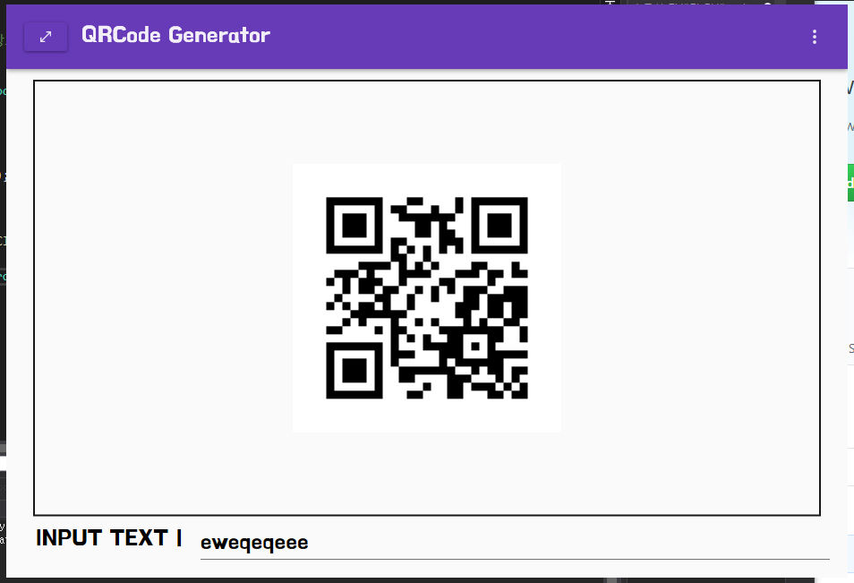

# WPF PRACTICE

## 1.  QR generator
QR코드 제너레이터
### design concept
1. material Design   
### control
material Design for wpf 

  
  
  

## 2. PC 방 상품 구매 앱
PC방 상품 구매앱
### design concept 
1. navigation
2. items display  
### control 
self create

